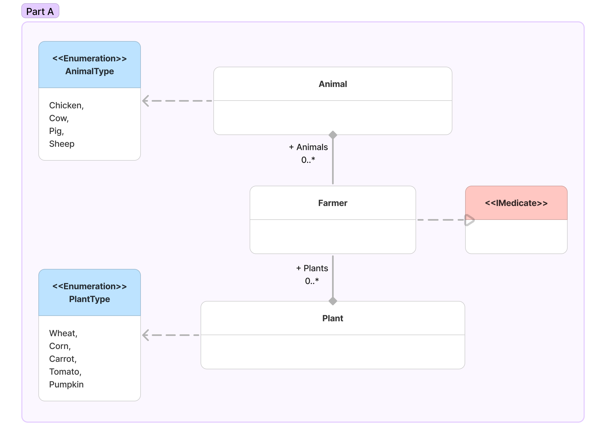
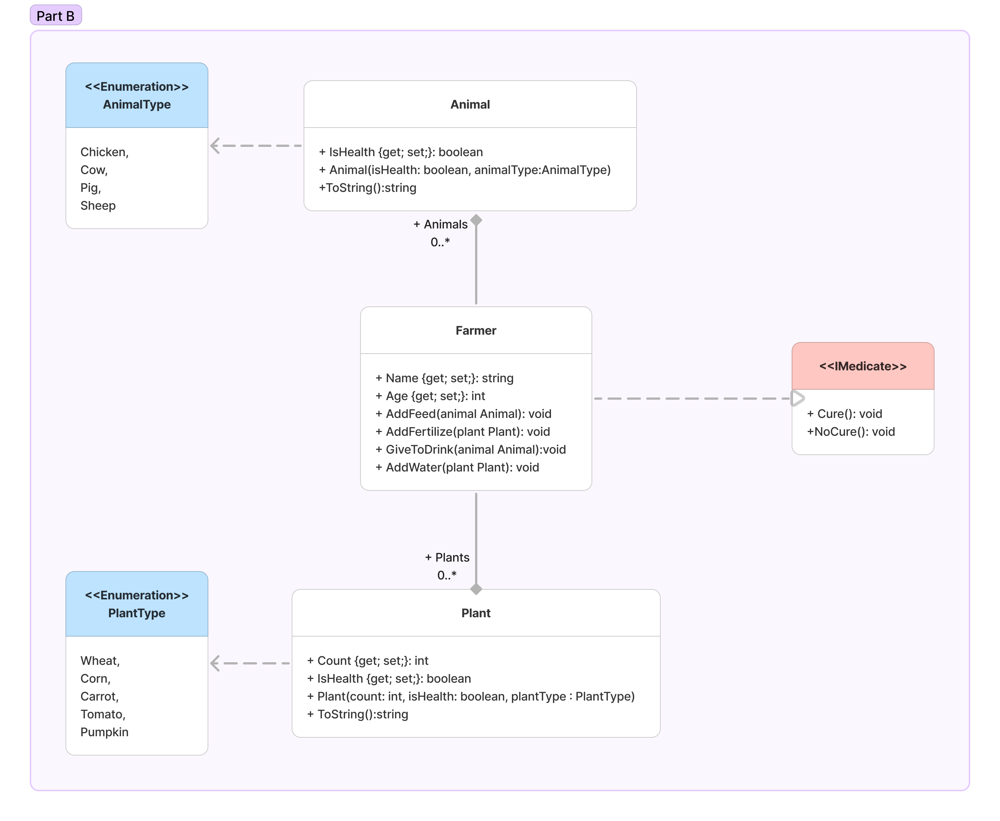

# Farm
>Ця предметна область описує фермерське господарювання, зокрема взаємодію фермера з тваринами та рослинами на фермі. 

_Ось кілька потреб користувачів якими повинен задовольняти застосунок:_

- Легка навігація та інтерфейс
- Мати змогу додати тварину або рослину
- Виведення всіх тварин та рослин на екран

***
___Нижче наведено короткий опис кожного елемента предметної області:___
***
### Клас Animal:
_Представляє тварину на фермі та має такі характеристики та функціональність:_

__Властивість IsHealth__ - вказує на стан здоров'я тварини (true - здорова, false - хвора).
__Конструктор Animal(isHealth: boolean, animalType: AnimalType)__ - ініціалізує новий екземпляр тварини з вказаним станом здоров'я та типом тварини.
__Метод ToString()__ - повертає рядок, представляючи об'єкт тварини у текстовому форматі.

### Перелічення AnimalType:
_Визначає можливі типи тварин, які можуть існувати на фермі:_
- Chicken (Курка)
- Cow (Корова)
- Pig (Свиня)
- Sheep (Вівця)
***
### Клас Plant:
_Представляє рослину, яку можна вирощувати на фермі:_

__Властивість Count__ - кількість рослин.
__Властивість IsHealth__ - вказує на стан здоров'я рослини (true - здорова, false - хвора).
__Конструктор Plant(count: int, isHealth: boolean, plantType: PlantType)__ - ініціалізує новий екземпляр рослини з вказаною кількістю, станом здоров'я та типом рослини.
__Метод ToString()__ - повертає рядок, представляючи об'єкт рослини у текстовому форматі.

### Перелічення PlantType:
_Визначає можливі типи рослин, які фермер може вирощувати:_

- Wheat (Пшениця)
- Corn (Кукурудза)
- Carrot (Морква)
- Tomato (Томат)
- Pumpkin (Гарбуз)
***

### Клас Farmer:
_Представляє фермера, який доглядає за тваринами та рослинами:_

__Властивість Name__ - ім'я фермера.
__Властивість Age__ - вік фермера.
__Метод AddFeed(animal Animal)__ - додає корм тварині.
__Метод AddFertilize(plant Plant)__ - додає добриво рослині.
__Метод GiveToDrink(animal Animal)__ - напоює тварину.
__Метод AddWater(plant Plant)__ - поливає рослину.
***

### Інтерфейс IMedicate:
_Визначає методи, пов'язані з лікуванням:_

__Метод Cure()__ - представляє лікування.
__Метод NoCure()__ - представляє відсутність лікування.
***

>Цей застосунок може відігравати роль освітнього, навчального та розважального засобу в залежності від ваших потреб та цілей.

